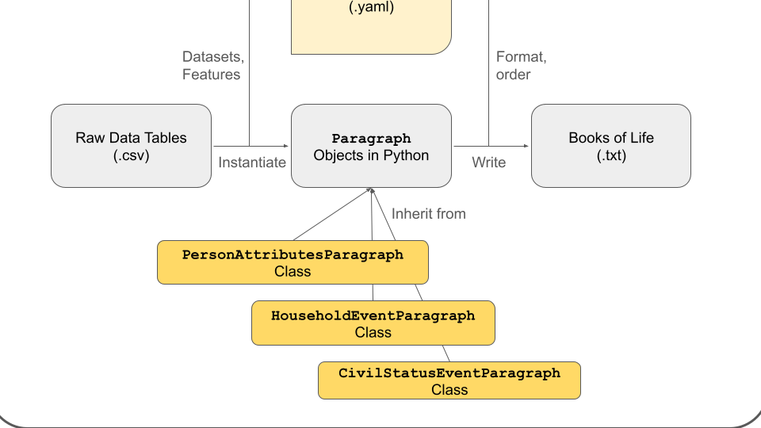

# Books of Life Toolkit (BOLT)

[](https://doi.org/10.48550/arXiv.2507.03027)
[](LICENSE)
[](https://github.com/MarkDVerhagen/BooksOfLifeToolkit/actions/workflows/ci.yml)

This repository contains the **Books of Life Toolkit (BOLT)**, a framework that turns
complex log data (such as national registry data) into plain-text "books of life"
(BoLs) that can be read and analyzed by Large Language Models.

BOLT is the open-source software accompanying the paper *"The Book of Life approach:
Enabling richness and scale for life course research"* (Verhagen, Stroebl, Liu, Liu,
and Salganik, 2025; [arXiv:2507.03027](https://doi.org/10.48550/arXiv.2507.03027)).
It was first developed for the [PreFer](https://preferdatachallenge.nl/)
data challenge on predicting fertility from Dutch population registry data.

## Why BOLT?

Social scientists have long navigated a trade-off between **depth** (rich,
single-case narratives analyzed qualitatively) and **scale** (large-N datasets
analyzed quantitatively). Two recent developments make it possible to explore
whether we can have both:

1. **Complex log data** that cover many facets of social life but are not recorded
   as a conventional survey (e.g. administrative registries).
2. **LLMs** with exceptional pattern-recognition abilities on free text.

BOLT bridges the two by programmatically writing out life events, contexts, and
relationships into human-readable narrative summaries — books of life — at scale.

## What does BOLT offer?

1. **Loss-minimal representation:** keeps longitudinal, hierarchical, and network
   structure that is usually flattened away.
2. **LLM-ready format:** plain text, immediately usable for prompting, retrieval,
   or fine-tuning.
3. **Composable recipes:** declaratively specify which variables, time windows, and
   social relations to narrate.
4. **Social context ("books within books"):** recursively include information about
   related people (household members, etc.).
5. **Runs on modest hardware:** processes registry-scale data on a standard server.

## Key concepts

1. **Books of Life (BoLs):** the primary output — a textual representation of a unit
   of analysis (e.g. a person) assembled from available data sources.
2. **Paragraphs:** the building blocks of a BoL. Each paragraph corresponds to a
   single record from an information source (e.g. a row in a table).
3. **Instantiators:** functions that turn raw rows from a data source into
   `Paragraph` objects. They live in `serialization/instantiator_scripts/` and are
   registered in `serialization/registry.py`.
4. **Recipes (`recipes/*.yaml`):** configuration files that define *how* to build a
   BoL — the **what** (information to include), the **who** (social context), and the
   **how** (filtering, ordering, and formatting).

<p align="center">
  
</p>

## Installation

BOLT targets **Python 3.11+** (developed and tested on 3.12).

```bash
git clone https://github.com/MarkDVerhagen/BooksOfLifeToolkit.git
cd BooksOfLifeToolkit
python3.12 -m venv venv
source venv/bin/activate          # On Windows: venv\Scripts\activate

# Core install (everything needed to generate books of life):
pip install -e .
# or, equivalently:
pip install -r requirements.txt
```

Optional extras:

```bash
pip install -e ".[stats]"   # token-length stats / fine-tuning helpers
pip install -e ".[dev]"     # pytest, for running the test suite
```

For an exactly pinned environment, use `pip install -r requirements-lock.txt`.

## Quickstart: generating books of life from synthetic data

This walkthrough uses **synthetic** data (no registry access required). The whole
pipeline is three steps.

**1. Generate synthetic data** (household and demographic tables that mimic the
structure of the Dutch registry):

```bash
python synth/main.py
```

**2. Build and populate the database.** This reads the configuration in
`recipes/make_db.yaml`, wrangles the synthetic CSVs, and writes a DuckDB database
to `dbs/db.duckdb`:

```bash
python serialization/make_db.py --data_dir synth/data --yaml_file recipes/make_db --db_name db
```

**3. Generate all books of life** using a recipe, saved as a JSONL file:

```bash
python main.py --db_path db.duckdb --recipe_path recipes/template --output_dir output
```

The result is `output/books.jsonl`, one JSON record per person. A single book looks
like:

```text
Country of Birth: NL
Gender: 2
Year of Birth: 1997
Mother's Gender: 2
Mother's Year of Birth: 1969
Father's Gender: 1
Father's Year of Birth: 1969

Household ID: 0fe4667f
Type of Household: single parent
Date Household Began: Jan 01 1997
Date Household Ended: Jan 01 1998
Number of People in Household: 2
Role in Household: child
Is Reference Person: no
Number of Children in Household: 1
...
```

### Inspecting a single person (and social context)

`main_test.py` prints the book for one individual — useful for debugging recipes.
The `social_context` recipe demonstrates "books within books", embedding short
sub-books for each household member:

```bash
# Replace the hash with a valid rinpersoon from your generated data.
python main_test.py --hash <rinpersoon> --recipe social_context --db_path db.duckdb
```

Example output (a partner and child written as nested books):

```text
Household ID: 21c9d5ea
Type of Household: married couple with children
Date Household Began: Jan 01 1990
Role in Household: partner

  [PARTNERS 64d6351a]
    Gender: 2
    Year of Birth: 1987

  [CHILDREN f66bd07d]
    Year of Birth: 1985
```

## Understanding recipes (`recipes/*.yaml`)

A recipe follows the three-step conceptual process of the paper:

1. **`main_key:`** the identifier for the unit of analysis (currently `rinpersoon`).
2. **`datasets:`** the information sources to include. Each entry specifies:
   - `name:` the table/dataset name (must be registered in
     `serialization/registry.py`).
   - `features:` which fields to include (see the corresponding `Paragraph`
     subclass for available fields).
   - `social_context_features:` (optional) the **who** — recursively write
     sub-books for related people such as `PARTNERS` and `CHILDREN`.
   - `n_spell:` (optional) keep only the *n* most recent spells.
3. **`formatting:`** controls output generation:
   - `sorting_keys:` how paragraphs are ordered (e.g. `year`).
   - `paragraph_generator:` `get_paragraph_string_tabular` for `key: value` pairs,
     or a source-specific biographic generator for sentence-like text.

See `recipes/template.yaml` (a demographics + household-history book) and
`recipes/social_context.yaml` (books within books) for complete, working examples.

## Extending BOLT: adding new data sources

The toolkit ships with two reference instantiators — `persoon_tab` (demographics)
and `household_bus` (household spells with social context). To add another source:

1. **Create a `Paragraph` subclass** in `serialization/instantiator_scripts/`
   describing the fields of the new source.
2. **Add an instantiator function** with the signature
   `instantiator(rinpersoons, conn, table_version="", explicit=True, order=0)`
   that returns `{rinpersoon: [Paragraph, ...]}`.
3. **Register it** in `serialization/registry.py`.
4. **Add a synthetic generator** under `synth/` so the new source can be exercised
   without real data, and a test under `tests/`.

## Downstream use: LLMs

The JSONL files produced by `main.py` are designed as input for downstream LLM
work: `book_content` is the text representation of a life, suitable for prompting,
retrieval, or supervised fine-tuning. The optional helper
`utils.utils.generate_token_length_stats` (install with `pip install -e ".[stats]"`)
reports the token-length distribution of a generated dataset. For the downstream
modeling that accompanied this work, see Satish et al. (2025).

## Data and ethics

This repository contains **only synthetic data**. The results in the paper were
computed inside Statistics Netherlands' (CBS) secure environment on non-public,
individual-level registry data, which cannot be shared. Reproducing the registry
results requires an institutional license and access to the CBS Remote Access
environment. Please do not commit real or individual-level data to this repository.

## Tests

```bash
pip install -e ".[dev]"
pytest -q
```

## Contributing

Contributions are welcome — see [CONTRIBUTING.md](CONTRIBUTING.md) and our
[Code of Conduct](CODE_OF_CONDUCT.md).

## License

BOLT is released under the [MIT License](LICENSE).

## Citation

If you use BOLT or the book of life approach, please cite:

```bibtex
@article{verhagen2025bookoflife,
  title         = {The Book of Life approach: Enabling richness and scale for life course research},
  author        = {Verhagen, Mark D. and Stroebl, Benedikt and Liu, Tiffany and Liu, Lydia T. and Salganik, Matthew J.},
  year          = {2025},
  journal       = {arXiv preprint arXiv:2507.03027},
  eprint        = {2507.03027},
  archivePrefix = {arXiv}
}
```
